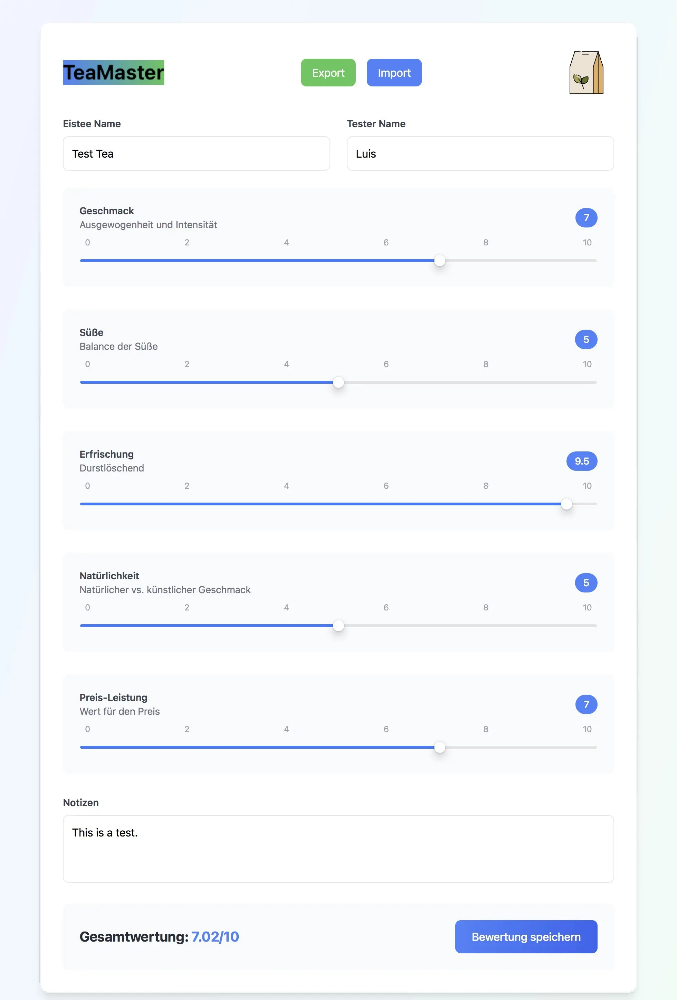
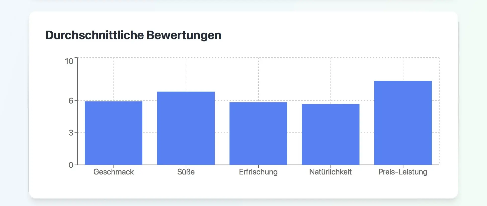
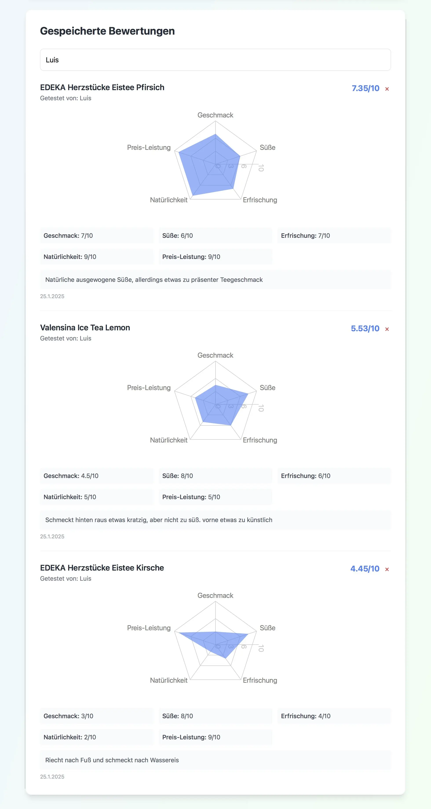

# TeeMaster

A desktop application for rating and analyzing iced teas, built with React and Electron.
Features

Rate iced teas on multiple criteria:

Taste balance and intensity (35%)
Sweetness balance (15%)
Refreshing quality (25%)
Natural taste vs artificial (15%)
Price-performance ratio (10%)


Visual data analysis through:

Bar charts showing average ratings across all criteria
Radar charts displaying individual tea profiles
Comprehensive rating history


Search and filter functionality
Import/Export capability for data backup
Local data persistence

Screenshots


  TeaMasters UI


  Bar Chart showing the average Ranking


  Ranking per Tea including Spider Plots

## Installation

```bash
git clone https://github.com/luislessing/TeaMaster.git
cd TeaMaster
npm install
```

## Development

```bash
npm run electron:dev
```

## Build

```bash
npm run electron:build
```

The AppImage will be created in the `release` folder.

## Converting TeaMaster to Web App

### Required Changes

1. Remove Electron dependencies:
```bash
npm uninstall electron electron-builder
```

2. Update package.json:
```json
"scripts": {
  "dev": "vite",
  "build": "vite build",
  "preview": "vite preview"
}
```

3. Update vite.config.js:
```javascript
import { defineConfig } from 'vite'
import react from '@vitejs/plugin-react'

export default defineConfig({
  plugins: [react()],
  base: './'
})
```

4. Install web dependencies:
```bash
npm install @vitejs/plugin-react
```

5. Build and deploy:
```bash
npm run build
# Upload dist folder contents to web server
```

6. Create .htaccess in web root:
```apache
<IfModule mod_rewrite.c>
  RewriteEngine On
  RewriteBase /
  RewriteRule ^index\.html$ - [L]
  RewriteCond %{REQUEST_FILENAME} !-f
  RewriteCond %{REQUEST_FILENAME} !-d
  RewriteRule . /index.html [L]
</IfModule>
```

### File Structure
```
webroot/
  ├── index.html
  ├── .htaccess
  └── assets/
```

## Technologies

- React
- Electron
- Vite
- TailwindCSS

## ToDO
- [x] customise look
- [x] implement Logo
- [x] implement export option
- [x] implement visual charts 
- [x] search function
- [x] deletable Entries
- [ ] User support
- [ ] Multilanguage support
- [ ] implement Tag System
- [x] implement Darkmode

## Customization
Feel free to adapt and modify the code to suit your testing needs. The application can be customized for different beverages, rating criteria, or evaluation purposes.

## License

MIT
